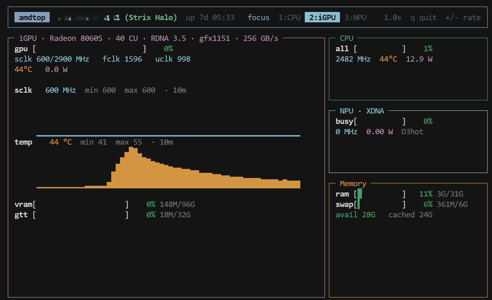

# amdtop

A [btop](https://github.com/aristocratos/btop)-style terminal monitor for **AMD Strix Halo** APUs
(Ryzen AI MAX series) that shows the **CPU, integrated GPU, and NPU side by side** in
one live-refreshing view.



## Why

Standard tools show one engine at a time (`btop`/`htop` for CPU, `amdgpu_top`/`radeontop` for
the GPU, and the NPU is largely invisible). On a Strix Halo APU all three compute engines share
one power/thermal/memory budget, so watching them together is what actually tells you where a
workload is bottlenecked. `amdtop` puts CPU, iGPU, NPU, and system memory on a single screen.

## Features

- **CPU** — per-thread utilization bars, per-core clocks, package power, Tctl temperature, load average.
- **iGPU** — busy %, unified VRAM/GTT usage, sclk/fclk/uclk, edge temperature, GPU power, plus
  **10-minute sclk & temperature trend plots**. PCI-ID decode surfaces the codename
  (**Strix Halo**) and architecture (**RDNA 3.5 · gfx1151**).
- **NPU (XDNA)** — per-column activity, IPU power and clock, power state, firmware version — all
  **without root**, read from the amdgpu `gpu_metrics` table.
- **Memory** — RAM and swap usage, available, cached.
- Live refresh with adjustable rate; single-snapshot mode for scripting.

## Requirements

- An AMD Strix Halo APU (Ryzen AI MAX / Radeon 8000S iGPU + XDNA NPU) on Linux with the
  `amdgpu` and `amdxdna` drivers loaded.
- Python 3.10+ and [`rich`](https://github.com/Textualize/rich).
- No root required — all telemetry comes from read-only `sysfs` / `/proc`.

## Install

```bash
pip install rich
pip install -e .        # provides the `amdtop` command
```

Or run straight from the source tree with `python -m amdtop`.

## Usage

```bash
amdtop                  # live dashboard (default 1.0s refresh)
amdtop -i 0.5           # refresh every 0.5s
amdtop --once           # print a single snapshot and exit
amdtop --version
```

In the live view: `q` quits, `+` / `-` speed up / slow down the refresh, and
`1` / `2` / `3` (or `Tab` to cycle) promote CPU, iGPU, or NPU to the dominant
pane while the other two collapse to compact summary rows.

## How it works

The heart of the tool is the amdgpu **`gpu_metrics_v3_0`** table exposed read-only at
`/sys/class/drm/card1/device/gpu_metrics`. On Strix Halo this single 264-byte blob reports
per-core CPU activity, iGPU (gfx) activity, and **NPU (IPU) activity/power/clock** — so no
privileged helper is needed for NPU visibility. The remaining data comes from `/proc/stat`,
`cpufreq`, `k10temp`, `/proc/meminfo`, and amdgpu memory sysfs.

```
amdtop/
  telemetry/
    gpu_metrics.py   parse the gpu_metrics_v3_0 blob (the golden source)
    cpu.py           /proc/stat deltas, cpufreq, k10temp, package power
    igpu.py          amdgpu sysfs + gpu_metrics
    memory.py        /proc/meminfo
    npu.py           NpuSource ABC + no-root GpuMetricsNpuSource
    decode.py        PCI-ID -> codename / RDNA arch / gfx target
    collector.py     reads gpu_metrics once, fans out to all sources
  ui/                Rich gauges, panels, layout
  app.py / cli.py    live loop + CLI
```

The NPU backend is behind an `NpuSource` interface, so a future root `debugfs` source can add
per-process NPU attribution without touching the UI.

## Development

```bash
pip install pytest
pytest
```

## Notes

Field offsets, scales, and PCI-ID mappings were validated against a live Ryzen AI MAX+ 395
(Radeon 8060S). Other Strix-family parts (Strix Point, Krackan, Phoenix) are in the decode
table but the metrics layout has only been verified on Strix Halo.
